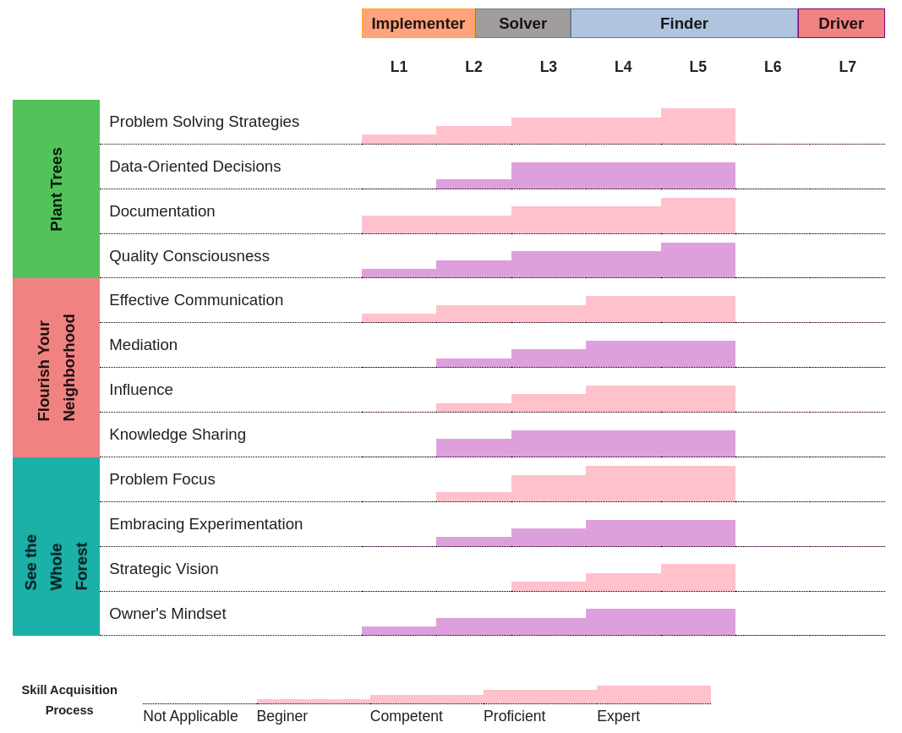

# Becoming a Driver

In the fast-paced world of technology, career growth for software developers is a top priority. To meet this demand, we're introducing our new model, Becoming a Driver, based on four key development stages: Implementer, Solver, Finder, and Driver.

Suppose you are looking for advice or tips on improving your ability to drive a car or other vehicle. In that case, this is the wrong place for you. The decision to choose the word **driver** is based on its intentionality; according to the Oxford Dictionary, one of its meanings is _"a factor that causes a particular phenomenon to occur or develop"._

Our VTEX career model is illustrated in the image below, with columns representing the Become a Driver journey and levels associated with each stage. The lines correspond to Engineering competencies, with a progression bar indicating the expected knowledge at each level. Reaching the solver stage is expected for all ICs, so becoming a finder or driver is not required, but we encourage further development.

_Disclaimer_: L0 (Intern), L6 (Principal Engineer) and L7 (Senior Principal Engineer) will be defined later as this is still under development.

<picture>
  <source srcset="stairs-chart-dark.png" media="(prefers-color-scheme: dark)" />
  
</picture>

Feel free to explore this guide on the best way for you, here are interesting starting points:

* [Becoming a driver journey](https://vtex.github.io/becoming-a-driver/journey/)
* [Engineering Competencies](https://vtex.github.io/becoming-a-driver/competencies/)
* [Career Path](https://vtex.github.io/becoming-a-driver/career-path/)
