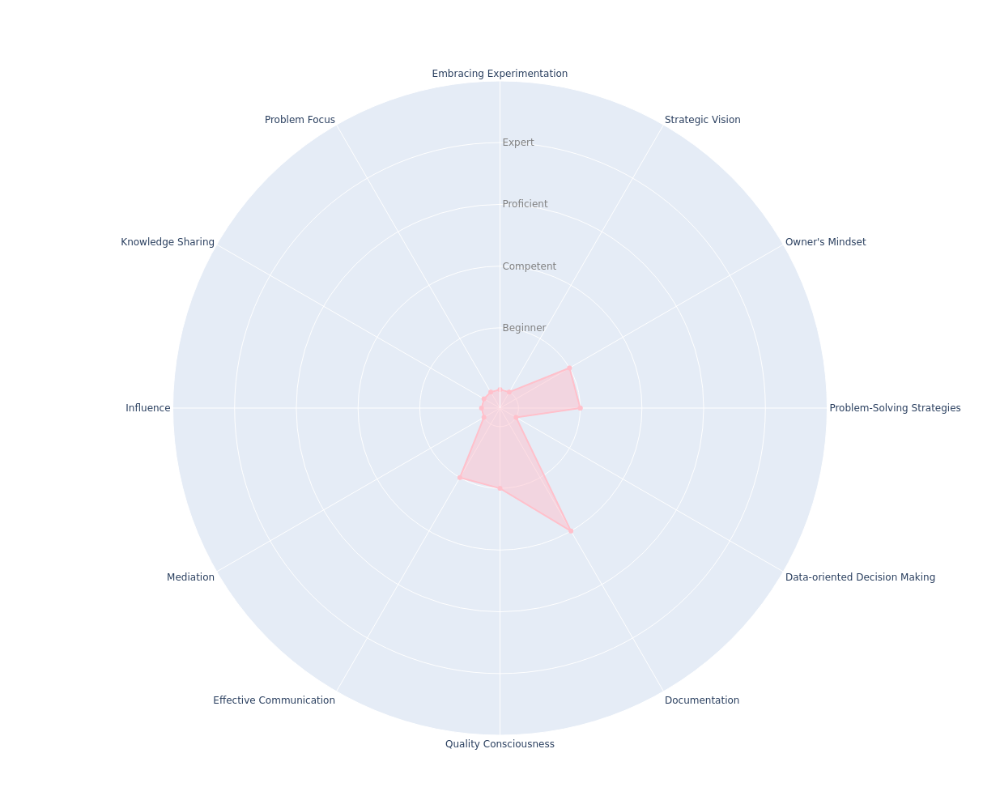

---
hide:
- toc
---

# Entry-Level Engineer

## Key Takeaways

* Develops good habits on coding, testing, documenting and more
* Builds expertise in your field's languages, tools, and standards
* Follows technical discussions
* Uses curiosity to build a broader understanding of the work

## Common Pitfalls

* Not asking for help. At this level you are expected to receive support from others. However, you should be aware that it is also essential to begin to develop your autonomy. Spend some time trying to resolve your questions by yourself, and if you do not know how to keep moving or if this does not generate results, ask for help to proactively unblock yourself. And don't worry, people will look forward to it. You are learning and asking for help is part of it.

As an entry-level engineer, you focus on gaining implementation-related skills. At this level, you build expertise in your field of work, whether it's languages, tools, standards, or related points.

It's crucial to establish good habits at this stage. A helpful tip is to consider documentation as something to build together with the implementation, not just at the end. Creating clear and straightforward code can be a form of documentation. Remember that code is usually written only once, but it's read multiple times, so building code with good readability is essential. Here's a famous quote in the computing world:

???+ quote
    _"I’m not a great programmer; I’m just a good programmer with great habits.”_
    -- __Kent Beck__

By the end of this level, the goal is for you to feel comfortable performing day-to-day tasks, helping in on-call rotations (not as primary on-call yet) and system operations, following technical discussions with more experienced people about implementation details, participating in pull request discussions, as well as having a broader view of product system design issues.
