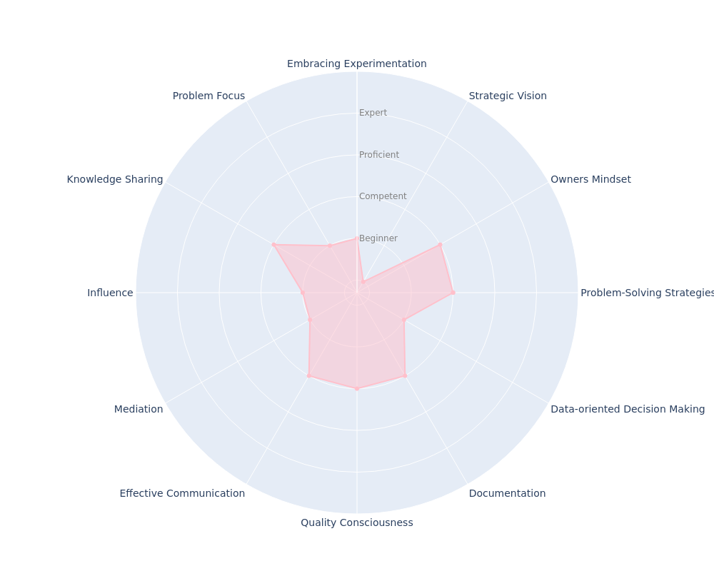

---
hide:
- toc
---
# Mid-Level Engineer

## Key Takeaways

* Remains focused on improving the implementation skills
* Develops team tasks with more autonomy
* Starts supporting the hiring process leading some interviews
* Helps teammates, especially L2 below, by sharing your knowledge
* Does problem-solving and impact assessment
* Balances between speed and quality when delivering, avoiding getting stuck frequently

## Common Pitfalls

* Is not continuously learning and exploring, leading to stagnant technical skills
* Has difficulty in collaborating effectively with team members
* Is not managing their time and priorities well

You will continue to focus on improving your implementation skills, but now the goal is to expand them since you already have a solid foundation in languages and tools. Therefore, you will shift your focus toward issues related to application design, integrations, and how to consume external dependencies.

At this stage, you will perform daily tasks autonomously, become a primary member on call, have a good understanding of the product operations, and share your knowledge with other team members.

Using your accumulated knowledge of the product, you will begin to understand how new features will impact existing ones and raise questions about the definition of done. You may suggest refactoring the codebase to support new functionality. Performing these tasks is crucial for developing problem-solving skills.

Making the decision of when to finalize an implementation is crucial, as it's easy to fall into the trap of constantly tweaking and adjusting, delaying delivery. However, delivering a solution that does not meet the definition of done, whether functional or non-functional, can create significant problems. Finding the balance between these two is essential. Here's a quote from a prominent computing thinker on the topic:

???+ quote
    _"The real problem is that programmers have spent far too much time worrying about efficiency in the wrong places and at the wrong times; premature optimization is the root of all evil (or at least most of it) in programming.”_
    -- __Donald Knuth__ (The Art of Computer Programming)

By the end of this level, you will be able to confidently assess the impact of new features on your codebase and propose new implementation and design solutions. Additionally, you will be capable of understanding the product's operational health, suggesting improvements to your product backlog and development process, and being a primary member of the on-call rotation.
