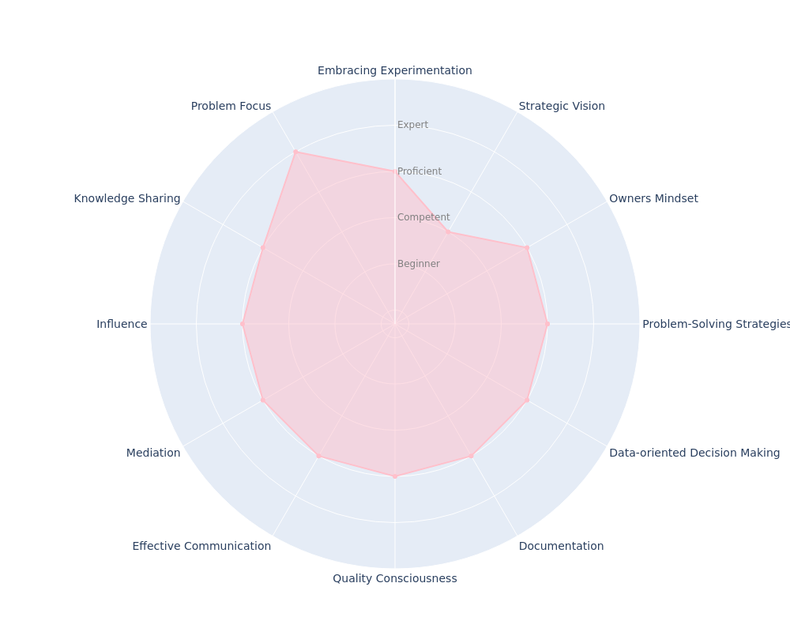

---
hide:
- toc
---
# Staff Engineer (L4)

## Key Takeaways

* Transitions from having a track record of a problem-solver to a finder role by learning to prioritize relevant problems and opportunities
* Influences others by showcasing the value of identified opportunities
* Consider both local and global perspectives when solving problems. A great solution for a single team can be detrimental for the whole journey/org
* Develops the ability to design and implement solutions that involve multiple systems and teams
* Builds stronger relationships with other teams and expands their support network
* Proactively start interacting with orgs beyond Engineer, like: customers, vendors, and partners

## Common Pitfalls

* Has difficulties balancing technical work with leadership responsibilities
* Fails to align technical decisions with overall business goals
* Does not focus on team development and mentorship
* Has difficulty effectively communicating and collaborating with other engineers and managers
* Is not mindful of when to adopt new technologies, either by adopting them too early or too late

## Discussion

When you begin working at this level, you are expected to have already established your problem-solving skills. Throughout this cycle, you will transition to acting as a finder. As a finder, you will actively participate in identifying the best opportunities to implement, using your sharpened product and engineering vision to anticipate relevant points for your product. While problem-solvers have a solid foundation for questioning and proposing improvements to items on your product roadmap, finders actively identify those opportunities. It's important to note that this does not mean you will become a PM (Product Manager).

At this stage, training your eyes to identify relevant problems is crucial. You'll start to see more and more things, but not every issue you encounter needs immediate attention. Instead of tackling everything that comes your way, developing a strategic vision for success is essential.

As a finder, you'll also need to exercise your influence by showing the value of the opportunities you identify to those around you. Finding an excellent opportunity is only helpful if you can convince others of its worth.

Establishing yourself as an interviewer in the hiring process is another relevant milestone. You should evaluate how the processes are occurring and identify opportunities for improving the interview loops. At this stage, you’re co-responsible for the quality of our new hires. 

As a Senior engineer, you may have already started breaking out of your team's bubble, but now you'll be able to work even more closely with other groups or a specific part of the product journey, further strengthening your support network. This moment is an excellent time to consolidate your mentoring and knowledge-sharing skills and be involved in more mediation situations. By doing so, you will reinforce your leadership position within this group.

One thing that will keep increasing is the ambiguity of the problems you will tackle. In addition to balancing short and long-term visions when evaluating a problem, you'll also need to consider another dimension: local and global perspectives. The sum of local maxima won't always result in the global maximum. Sometimes, several iterations will be necessary to arrive at a good solution, but it's essential to learn from all of them. The following quote illustrates this point:

???+ quote
    _"I have not failed. I've just found 10,000 ways that won't work.”_
    -- __Thomas A. Edison__

At the end of this level, you will be able to comfortably design and implement solutions with a moderate level of ambiguity, which may involve communication between many systems and teams. The solutions you propose must balance short and long-term goals and aim for a point of global maximum rather than local.

You will also gain the ability to identify and mitigate design problems in both the products you work with daily and those presented in design documents.
In addition to delivering improvements to your product, it's essential that you have helped develop other people and contributed to recruitment processes.
